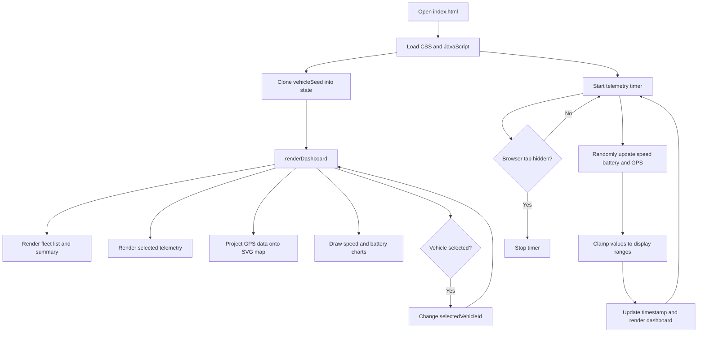

# Fleet Telemetry Dashboard

A browser-based dashboard that simulates live telemetry for five fleet vehicles. It is a static front-end application, so it needs no backend, database, or external API.

## Features

- Fleet summary: online vehicles, average speed, average battery, and active routes
- Vehicle list with status, speed, and battery level
- Selected vehicle speed gauge, battery indicator, GPS coordinates, and status labels
- SVG route map with a marker for every vehicle
- Speed and battery trend charts drawn on HTML canvas
- Automatic telemetry updates every 1.8 seconds

## System Flow



### Runtime behavior

1. `vehicleSeed` defines vehicle IDs, statuses, initial telemetry, and route points.
2. `state` stores current vehicles, the selected vehicle, chart history, and update time.
3. `renderDashboard()` refreshes every visible dashboard section from `state`.
4. Selecting a vehicle updates `selectedVehicleId` and refreshes its telemetry view.
5. Every 1.8 seconds, the timer changes telemetry values and renders the dashboard again.
6. Updates pause while the browser tab is hidden and resume when it is visible.

## Data Rules

- Vehicles with status other than `Maintenance` count as online.
- Active routes count vehicles with status `Active`.
- Speed is constrained to `8-105 km/h`.
- Battery is constrained to `12-100%` and decreases gradually during simulation.
- GPS values stay within the Toronto-area map bounds defined in `script.js`.
- Speed status: `Low` below 35, `Nominal` from 35 through 75, and `High` above 75 km/h.
- Battery status: `Low` below 30%, `Moderate` from 30% through 59%, and `Healthy` from 60% upward.

## Run Locally

Requirements: Python 3 and Node.js with npm for browser tests.

From the workspace root:

```bash
cd fleet_telemetry_system
python -m http.server 8000
```

Open <http://localhost:8000> in a browser.

## Test the Dashboard

Install the Playwright dependencies and run the end-to-end tests:

```bash
cd fleet_telemetry_system
npm install
npm test
```

Run with visible browsers using:

```bash
npm run test:headed
```

The test suite checks dashboard startup, summary metrics, vehicle selection, telemetry values, the SVG map, and both charts in Chromium, Firefox, and WebKit. The test server starts automatically on port `4173`.

## Project Structure

| File | Purpose |
| --- | --- |
| `index.html` | Dashboard markup, telemetry cards, map, and chart canvases |
| `style.css` | Layout, colors, gauges, map styling, and responsive presentation |
| `script.js` | Seed data, state, rendering, simulation timer, and chart drawing |
| `tests/dashboard.spec.ts` | End-to-end Playwright tests |
| `playwright.config.ts` | Test browsers, local server, and test settings |
| `package.json` | Test scripts and development dependencies |

## Current Scope

This is a front-end demonstration. Data resets on reload, telemetry is randomized rather than sensor-backed, and the map is an SVG route visualization. The project does not currently provide persistence, authentication, alert delivery, real-time network transport, or a production map service.
